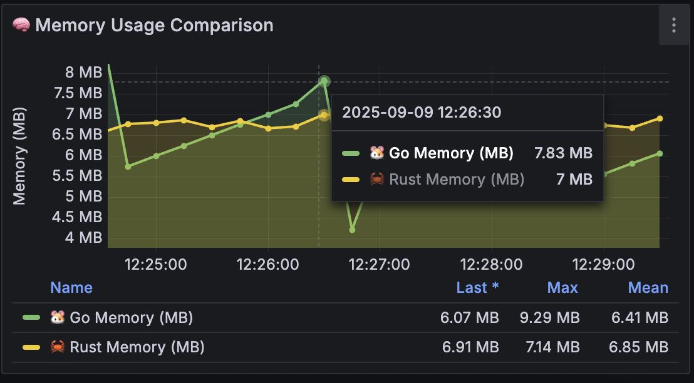
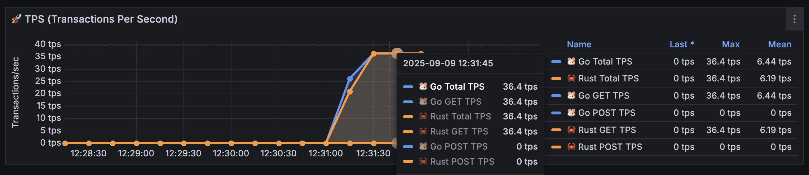
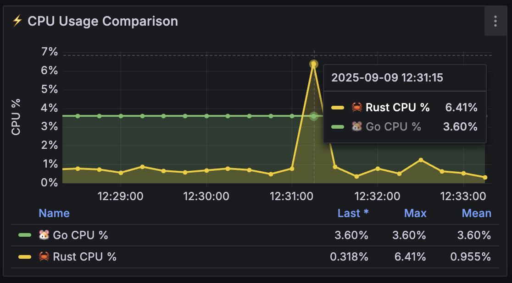
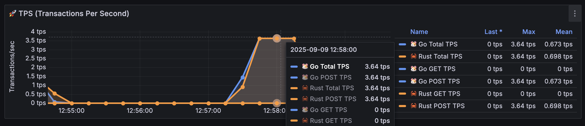
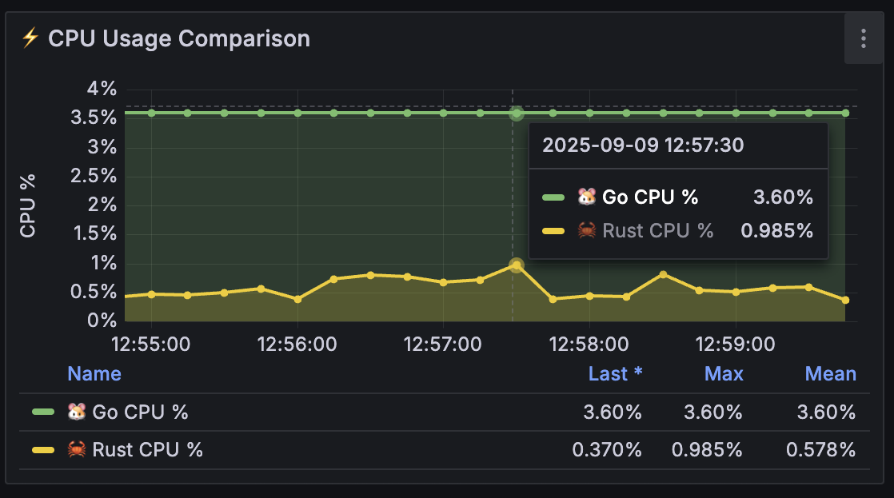
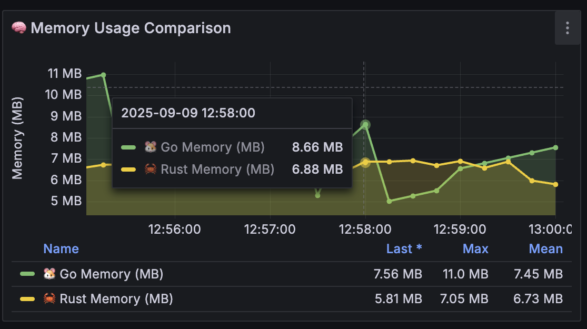
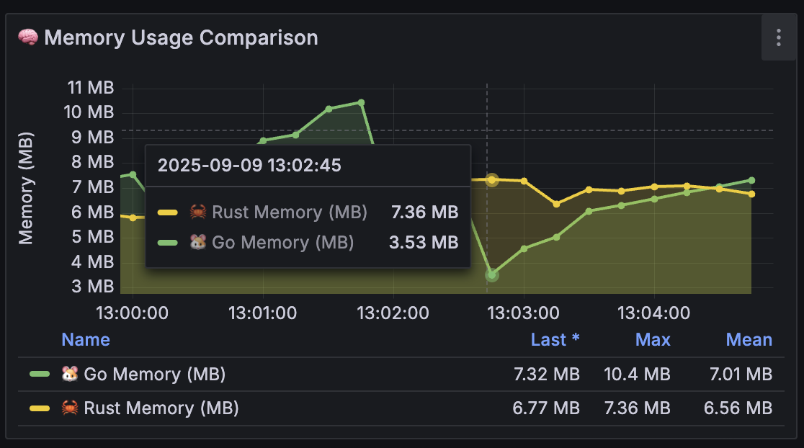
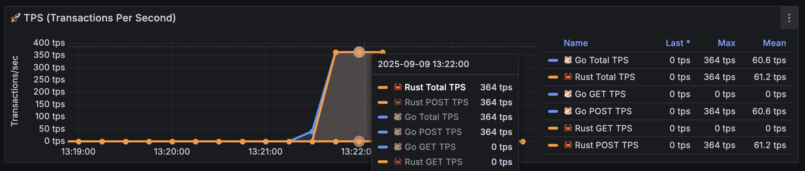
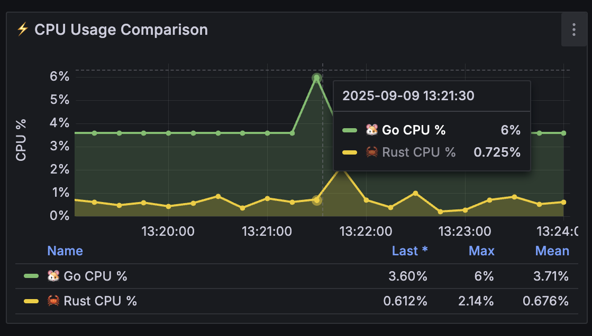

# Load Testing Summary: Golang vs Rust Performance Comparison

## Executive Summary

Based on comprehensive load testing results between Golang and Rust applications, both applications show identical throughput performance but with significantly different resource usage characteristics.

### Key Findings:
- **Throughput**: Both applications achieve identical throughput across all testing scenarios
- **🔥 CPU Rust**: Experiences dramatic spikes under high load, especially during POST requests (up to 8.83% from baseline 0.861%)
- **📉 Memory Go**: Shows sudden drop patterns followed by gradual increase, particularly visible in GET test config 3 (drops from ~7MB to 2.62MB)

---

## Initial Setup (Idle State)
**Duration**: 5 minutes warmup

| Language | CPU Usage | Memory Usage |
|----------|-----------|--------------|
| **Go** | 3.60% | 8.15 MB |
| **Rust** | 0.861% | 7.31 MB |

---

## HTTP GET Request Testing

### Test Configuration 1: Light Load
**Parameters**: 20 threads, 10s ramp-up, 10 loops  
**Total Requests**: 200 per application

#### Peak Performance Metrics

| Metric | Go | Rust |
|--------|----|----- |
| **TPS Peak** | 3.64 | 3.64 |

| Metric | Go | Rust |
|--------|----|----- |
| **CPU Peak** | 3.60% | 0.873% |

| Metric | Go | Rust |
|--------|----|----- |
| **Memory Peak** | 7.83 MB | 7.00 MB |

### Test Configuration 2: Medium Load  
**Parameters**: 200 threads, 10s ramp-up, 10 loops  
**Total Requests**: 2,000 per application

#### Peak Performance Metrics

| Metric | Go | Rust |
|--------|----|----- |
| **TPS Peak** | 36.4 | 36.4 |

| Metric | Go | Rust |
|--------|----|----- |
| **CPU Peak** | 3.60% | **6.41%** ⚡ |

| Metric | Go | Rust |
|--------|----|----- |
| **Memory Peak** | 7.30 MB | 6.52 MB |

### Test Configuration 3: High Load
**Parameters**: 2,000 threads, 10s ramp-up, 10 loops  
**Total Requests**: 20,000 per application

#### Peak Performance Metrics

| Metric | Go | Rust |
|--------|----|----- |
| **TPS Peak** | 364 | 364 |

| Metric | Go | Rust |
|--------|----|----- |
| **CPU Peak** | 3.60% | 4.50% |

| Metric | Go | Rust |
|--------|----|----- |
| **Memory Peak** | **2.62 MB** 📉 | 7.38 MB |

> **🔍 Notable**: Go experiences dramatic memory usage reduction during high load GET requests

---

## HTTP POST Request Testing

### Test Configuration 1: Light Load
**Parameters**: 20 threads, 10s ramp-up, 10 loops  
**Total Requests**: 200 per application

#### Peak Performance Metrics

| Metric | Go | Rust |
|--------|----|----- |
| **TPS Peak** | 3.64 | 3.64 |

| Metric | Go | Rust |
|--------|----|----- |
| **CPU Peak** | 3.60% | 0.985% |

| Metric | Go | Rust |
|--------|----|----- |
| **Memory Peak** | 8.66 MB | 6.88 MB |

### Test Configuration 2: Medium Load
**Parameters**: 200 threads, 10s ramp-up, 10 loops  
**Total Requests**: 2,000 per application

#### Peak Performance Metrics

| Metric | Go | Rust |
|--------|----|----- |
| **TPS Peak** | 36.4 | 36.4 |

| Metric | Go | Rust |
|--------|----|----- |
| **CPU Peak** | 3.60% | **8.83%** 🔥 |

| Metric | Go | Rust |
|--------|----|----- |
| **Memory Peak** | **3.53 MB** 📉 | 7.36 MB |

> **🔥 Critical**: Rust experiences highest CPU spike during POST medium load (8.83% vs baseline 0.861%)

### Test Configuration 3: High Load
**Parameters**: 2,000 threads, 10s ramp-up, 10 loops  
**Total Requests**: 20,000 per application

#### Peak Performance Metrics

| Metric | Go | Rust |
|--------|----|----- |
| **TPS Peak** | 364 | 364 |

| Metric | Go | Rust |
|--------|----|----- |
| **CPU Peak** | 6.00% | 0.725% |

| Metric | Go | Rust |
|--------|----|----- |
| **Memory Peak** | 3.03 MB | 7.56 MB |

---

## Performance Analysis & Insights

### 🔥 Rust CPU Behavior
- **Baseline**: Very low CPU usage (0.861%) during idle state
- **Spike Pattern**: CPU jumps dramatically during medium load, especially POST requests
- **Peak Spike**: 8.83% during POST medium load (almost 10x from baseline)
- **Recovery**: Returns to normal during high load POST (0.725%)

### 📉 Go Memory Behavior  
- **Pattern**: Unusual memory reduction in several scenarios
- **Dramatic Drop**: From 7-8MB down to 2-3MB during high load scenarios
- **Hypothesis**: Likely aggressive garbage collection or memory optimization
- **Consistency**: This pattern consistently occurs in GET config 3 and POST config 2-3

### 🎯 Performance Comparison
| Aspect | Golang | Rust | Winner |
|--------|--------|------|--------|
| **Throughput** | Identical | Identical | **Tie** |
| **CPU Efficiency** | Consistent | Spike-prone | **Go** |
| **Memory Stability** | Variable | Stable | **Rust** |
| **Resource Predictability** | High | Low | **Go** |

### 📊 Recommendations
1. **For Production**: Go is more predictable for CPU usage
2. **For Memory-Sensitive Apps**: Rust is more consistent in memory usage
3. **For High-Load POST**: Watch out for CPU spikes in Rust
4. **For Long-Running Services**: Go memory patterns need closer monitoring

---

*Test conducted with identical load parameters across both applications. Peak values represent highest recorded metrics during active request processing.*