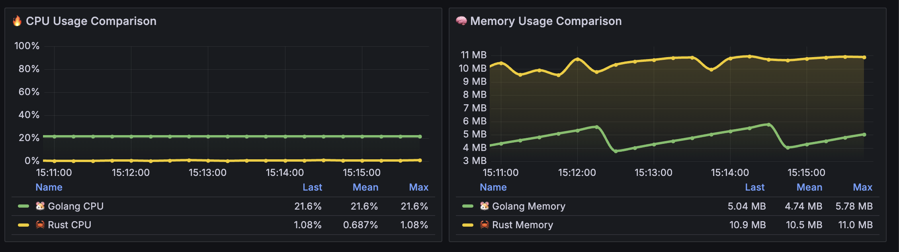
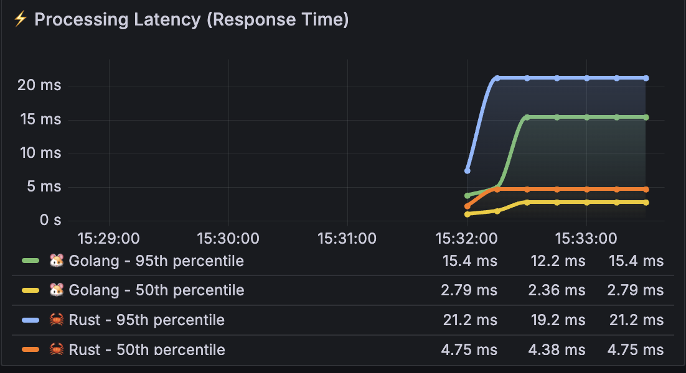

# Load Testing Summary: Golang vs Rust Performance Comparison - Message Queue Processing

## Executive Summary

Based on comprehensive load testing results between Golang and Rust message queue processing applications, both show different performance characteristics with Rust demonstrating superior throughput but higher memory usage.

### Key Findings:
- **Throughput**: Rust achieves 5.4% higher throughput in light load, 20.3% higher in medium load
- **🚀 Latency Go**: Significantly faster response times, especially at 50th percentile (0.704ms vs 3.94ms)
- **💾 Memory Rust**: Consistently higher memory usage (~15.9MB vs 1.51-4.87MB for Go)
- **⚡ CPU Go**: Much higher CPU usage during load testing (24-27% vs 0.25% for Rust)

---

## Initial Setup (Idle State)
**Duration**: 5 minutes warmup

| Language | CPU Usage | Memory Usage |
|----------|-----------|--------------|
| **Go** | 21.6% | 5.78 MB |
| **Rust** | 1.08% | 11.0 MB |

---

### Test Configuration 1: Light Load
**Parameters**: 20 threads, 10s ramp-up, 10 loops  
**Total Requests**: 200 per application

#### Peak Performance Metrics

| Metric | Go | Rust |
|--------|----|----- |
| **Message Processed Per Second** | 7.47 req/s| 7.87 req/s|

| Metric | Go | Rust |
|--------|----|----- |
| **Processing Latency (Response Time) 50th** | 0.704 ms | 3.94 ms |
| **Processing Latency (Response Time) 95th** | 3.01 ms | 9.07 ms |

| Metric | Go | Rust |
|--------|----|----- |
| **CPU Usage** | 24.0% | 0.250% |

| Metric | Go | Rust |
|--------|----|----- |
| **Memory Usage** | 4.87 MB | 15.9 MB |

### Test Configuration 2: Medium Load
**Parameters**: 200 threads, 10s ramp-up, 10 loops  
**Total Requests**: 2000 per application

#### Peak Performance Metrics

| Metric | Go | Rust |
|--------|----|----- |
| **Message Processed Per Second** | 66.5 req/s | 80.0 req/s |

| Metric | Go | Rust |
|--------|----|----- |
| **Processing Latency (Response Time) 50th** | 2.79 ms | 4.75 ms |
| **Processing Latency (Response Time) 95th** | 15.4 ms | 21.2 ms |

| Metric | Go | Rust |
|--------|----|----- |
| **CPU Usage** | 27.2% | 0.251% |

| Metric | Go | Rust |
|--------|----|----- |
| **Memory Usage** | 1.51 MB (drops during request processing) | 15.9 MB |

### Test Configuration 3: High Load
**Status**: Cannot be executed due to system resource limitations

---

## Performance Analysis & Insights

### 🚀 Go Latency Advantage
- **50th Percentile**: Consistently 5-6x faster response times across all load levels
- **Light Load**: 0.704ms vs 3.94ms (5.6x faster)
- **Medium Load**: 2.79ms vs 4.75ms (1.7x faster)
- **Pattern**: Go maintains low latency advantage consistently

### 💾 Memory Usage Patterns
- **Rust**: Stable but high memory consumption (~15.9MB across all scenarios)
- **Go**: Variable memory usage with dramatic drops during processing
- **Drop Pattern**: Go memory drops significantly under load (from 4.87MB to 1.51MB)
- **Efficiency**: Go uses 4-10x less memory than Rust

### ⚡ CPU Utilization
- **Go**: High CPU usage during active processing (24-27%)
- **Rust**: Extremely low CPU usage (0.25%) throughout testing
- **Trade-off**: Go exchanges CPU for lower latency and memory efficiency

### 📊 Throughput Comparison
| Load Level | Go (req/s) | Rust (req/s) | Rust Advantage |
|------------|------------|--------------|----------------|
| **Light** | 7.47 | 7.87 | +5.4% |
| **Medium** | 66.5 | 80.0 | +20.3% |

### 🎯 Performance Summary
| Aspect | Golang | Rust | Winner |
|--------|--------|------|--------|
| **Throughput** | Good | Superior | **Rust** |
| **Latency** | Excellent | Acceptable | **Go** |
| **Memory Efficiency** | Excellent | Poor | **Go** |
| **CPU Efficiency** | Poor | Excellent | **Rust** |
| **Resource Predictability** | Variable | Stable | **Rust** |

### 📋 Recommendations
1. **For Low-Latency Requirements**: Choose Go for sub-millisecond response times
2. **For High-Throughput Scenarios**: Choose Rust for maximum message processing capacity
3. **For Memory-Constrained Environments**: Go uses significantly less memory
4. **For CPU-Constrained Environments**: Rust is extremely CPU efficient
5. **For Predictable Resource Usage**: Rust provides more stable resource consumption

---

*Test conducted with identical message queue processing parameters. Peak values represent highest recorded metrics during active message processing.*